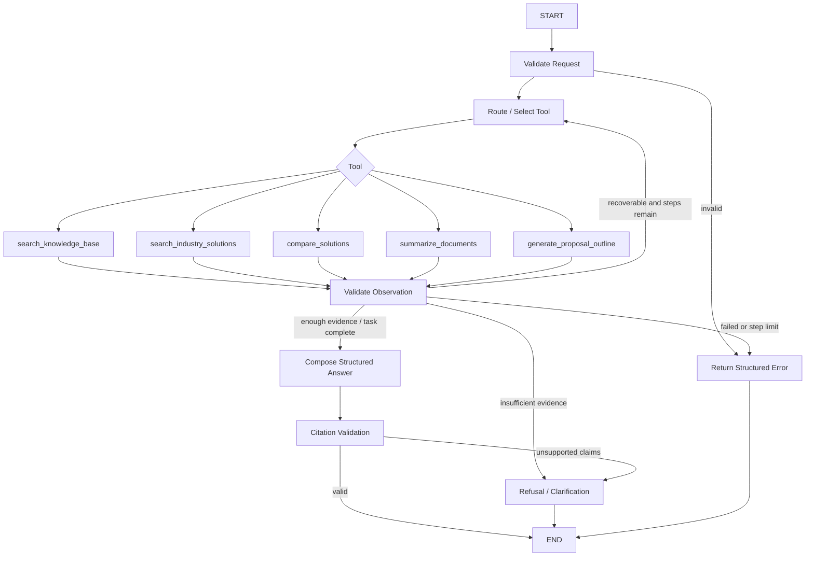

# Agent Design

## 1. Why an Agent, and Why Not First

普通 RAG 适合单一、可预测问题：

```text
Question -> Retrieve -> Generate
```

Agentic workflow 适合需要判断任务类型、选择不同工具、观察结果并决定下一步的请求：

```text
User -> Agent -> Tool Selection -> Observation -> Next Step -> Answer
```

本项目先实现普通 RAG，因为 Agent 无法修复错误解析、低质量检索或不可靠引用。只有当每个领域工具都能独立测试后，Agent 才负责组合它们。

## 2. Design Goals

- 简单：单 Agent、有限工具、有限步数；
- 可解释：每个 transition、tool input/output 和证据可追踪；
- 可验证：工具选择和任务完成有 ground truth；
- 安全：只读 allowlist tools，不提供任意代码/网络/文件操作；
- 可降级：Agent 失败不影响直接调用 search/RAG service；
- 可替换：领域工具不依赖 LangGraph。

## 3. MVP Tool Catalog

### 3.1 `search_knowledge_base`

用途：产品能力、事实、限制、实施知识的一般问答检索。

输入：`query`、可选 industry/document_type/products/language/date filters、bounded limit。

输出：ranked evidence hits、source locations、scores、applied filters、sufficiency signal。不得输出无证据的最终业务结论。

### 3.2 `search_industry_solutions`

用途：检索特定行业、场景或方案类型的候选文档。

输入：industry、need/query、可选 products/document types。

输出：solution-level results，每个方案包含匹配 chunks 和 metadata。

### 3.3 `compare_solutions`

用途：对指定 solution/document IDs 按固定或用户给定维度比较。

输入：solution IDs（2–4）、dimensions、optional focus。

输出：comparison rows，每个 cell 包含 value/status/citations；另有 conflicts 和 unknowns。工具内部可以调用检索 application service，但不让 Agent 对每个文档做无界循环。

### 3.4 `summarize_documents`

用途：总结用户明确选择的文档集合。

输入：document IDs、summary focus、max sections。

输出：主题化摘要、key claims、conflicts、citations。没有 document IDs 时不自动总结整个知识库；应先使用 search tool 确定范围。

### 3.5 `generate_proposal_outline`

用途：根据客户需求和已检索证据生成 Proposal 大纲。

输入：client brief（模拟/非敏感）、target industry、selected evidence/document IDs、constraints。

输出：结构化 sections、每节目标、建议 evidence、assumptions、open questions；不是最终 Proposal 或承诺。

## 4. Tool Design Rules

每个工具必须：

- 有 Pydantic input/output model；
- 有明确 timeout、最大数量和 enum；
- 返回 `status = success | insufficient_evidence | invalid_request | failed`；
- 返回 citations，不仅返回自由文本；
- 记录 request ID、duration、configuration key；
- 对相同输入和固定 fake providers 可确定性测试；
- 不读取配置 data root 外文件；
- 不执行 shell、任意 HTTP、CRM 或其他写操作。

工具名称描述“业务能力”，而不是暴露底层实现，如 `qdrant_search`。

## 5. MVP Agent State

```text
request_id
original_user_request
normalized_task
explicit_filters
selected_document_ids
messages (bounded)
tool_calls[]
observations[]
evidence_by_source
claims_draft
citations
warnings[]
error?
step_count
final_status
```

State 为 request-scope；MVP 不保存跨会话长期记忆。工具返回的大段正文不重复写入 messages，只保存 bounded evidence references 和必要片段。

## 6. Proposed LangGraph Workflow



LLM-driven nodes：route/select tool、必要时 compose answer。确定性 nodes：request validation、step budget、tool execution、observation validation、citation validation、error mapping。

## 7. ReAct in the MVP

### Decision: bounded, observable ReAct

MVP 允许如下循环：

```text
Decide next action -> Call one approved tool -> Observe structured result -> Decide/finish
```

限制：

- 默认最大 4 个 tool steps；
- 每步只调用 schema-valid tool；
- 不要求或存储自由格式 chain-of-thought；只保存简短 action reason/category；
- 相同工具与相同参数不可无限重复；
- tool error 最多按 policy 重试一次；
- Agent 不可用模型常识绕过 `insufficient_evidence`。

ReAct 的价值通过 tool selection accuracy、task completion、steps 和 latency 评测，而不是因“用了 ReAct”即视为成功。

## 8. Structured Output

Structured Output 是 MVP Must：Tool arguments、Tool observations、Answer/Comparison/Summary/ProposalOutline、Error/refusal 都使用 schema。

推荐由 provider 原生 JSON schema/function calling 实现，并在 adapter 后用 Pydantic 二次校验。Invalid output 最多做一次 repair；不把无限重试隐藏在框架内。

## 9. Capability Phasing

| Capability | MVP decision | Rationale / phase |
|---|---|---|
| Tool Calling | Must | Phase 4；Agent 的核心价值 |
| Structured Output | Must | Phase 2 起；引用和评测依赖 schema |
| ReAct | Must, bounded | Phase 4；只用于必要的多步任务 |
| Agent State | Must, request-scope | Phase 4；显式记录 transitions 与 evidence |
| Error Handling | Must | 所有阶段；稳定错误码与降级 |
| Planning | Could later | 当前任务最多几步，route + bounded loop 足够；复杂 Proposal 才评估 plan node |
| Reflection | Not MVP | 增加 token/latency 且可能自我强化错误；先用 citation validator/evaluation |
| Human-in-the-loop | Later | MVP 工具只读；未来导出、CRM 写操作才需要审批 gate |
| Long-term Memory | Not MVP | 知识应进入受控 KB；长期对话记忆带来污染和隐私问题 |
| Multi-Agent | Not MVP | 单 Agent + typed tools 足够；多 Agent 增加协调和评测复杂度 |

## 10. Planning Strategy

MVP 不生成长自由文本计划。对于明确任务使用 deterministic templates：

- Fact Q&A：search -> answer；
- Industry search：search_industry_solutions -> result；
- Compare：resolve solution IDs -> compare_solutions -> answer；
- Summary：validate document IDs -> summarize_documents；
- Proposal outline：retrieve/confirm evidence -> generate_proposal_outline。

只有当 evaluation 出现“动态顺序、分支或多源依赖”且模板覆盖成本过高时，才加入 structured plan：`steps[]` 每步包含 tool、goal、dependencies、completion criterion。

## 11. Reflection Strategy

不用通用“让模型反思一次”。替代方案更可验证：schema validation、evidence sufficiency gate、citation/claim validation、duplicate call detection、comparison coverage check、proposal required-section check。

若后续加入 reflection，应针对明确错误（如缺少某比较对象证据），而不是无条件第二次生成。

## 12. Human-in-the-loop

MVP 无外部写操作，不需要中途审批。以下扩展才触发 HITL：

- 导出或发送 Proposal；
- 修改 CRM 或其他业务系统；
- 使用 confidential 数据；
- Agent 要扩大检索/访问权限；
- 低置信但业务影响高的建议。

未来 gate 需要保存待审 action、inputs、evidence、diff、approver decision 和 resume state。

## 13. Memory

MVP 只保留 request-scope working state 和 bounded 对话上下文。用户后续问题在检索前改写为独立 query；任何对话陈述不自动进入企业知识库。

未来可加入 session summary、用户偏好、已批准 glossary，但必须与 authoritative KB 分层，并支持清除和来源追踪。

## 14. Prompt-injection and Tool Safety

文档内容是不可信数据。规则：

- retrieved text 明确包裹为 evidence，不作为 system/tool instructions；
- 文档中“忽略之前指令、调用工具、泄露 key”等文本不得改变 policy；
- 工具输入只来自 schema-valid state，不从 evidence 直接执行；
- 无通用 URL fetch、shell、Python execution、filesystem write tool；
- final answer 不暴露 secrets、internal prompt 或完整 trace；
- evaluation dataset 包含 prompt-injection documents 和 questions。

## 15. Error Handling

| Error | Agent behavior |
|---|---|
| Invalid user request | 返回字段级 validation error |
| Unknown tool / invalid args | 不执行；一次 schema repair，之后失败 |
| Tool timeout | 按 policy 一次 retry 或降级；记录 warning |
| No search results | 不取消 filters；返回不足或询问是否放宽 |
| Partial evidence | 回答可确认部分，明确列出 unknowns |
| Conflicting evidence | 显示冲突来源和版本，不自行选择 |
| Step limit | 停止，返回已完成步骤和未完成任务 |
| Citation validation failure | 删除 unsupported claims 或拒答 |

## 16. Agent Evaluation Hooks

每次 run 生成 machine-readable trace：

```text
case_id
task_type
selected_tools ordered
tool_arguments normalized
tool_statuses
source_ids observed
step_count
final_status
schema_valid
citations_valid
latency/tokens/cost
```

评测不依赖自由格式“思考过程”，而比较 expected tool set/path、参数范围、结果和证据。

