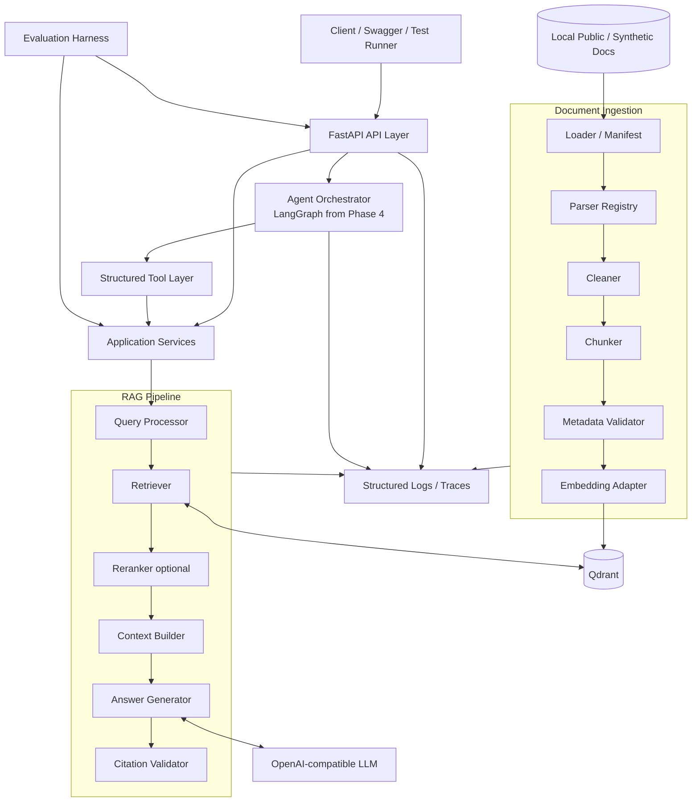
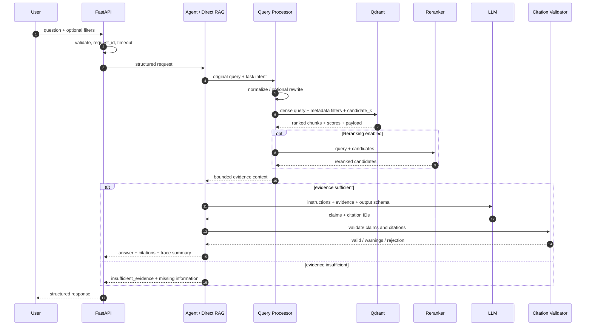
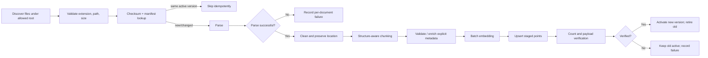
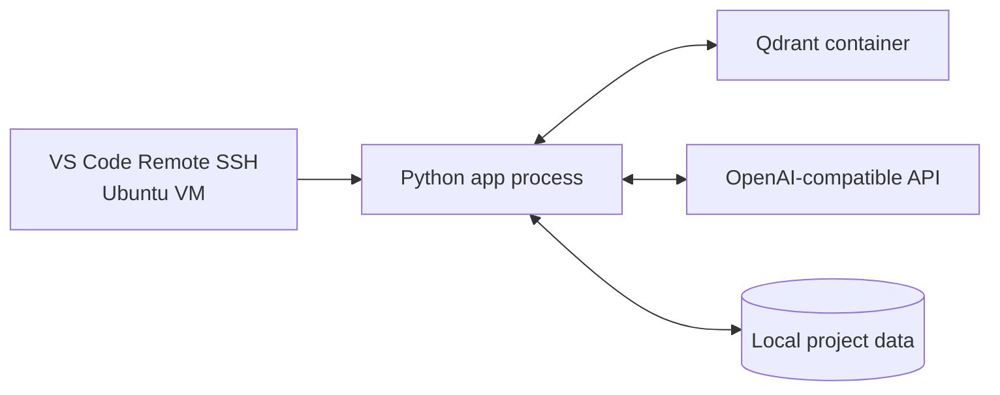

# Architecture

## 1. Architectural Style

MVP 采用**模块化单体（modular monolith）**：一个 Python application repository、一个 API process、一个本地 Qdrant service。Ingestion 与 evaluation 通过同一代码库中的 scripts/CLI 运行。

原因：

- 当前规模不需要独立部署和弹性扩容各模块；
- 解析、检索、生成和评测需要共享领域模型与配置；
- 单体更容易本地调试、端到端测试和演示；
- 通过 adapter/interfaces 保持模块边界，未来有实际负载证据时再拆分。

MVP 不引入 Kafka、Redis、Kubernetes、服务网格或独立 workflow service。

## 2. Component Architecture



### 2.1 API Layer

职责：

- HTTP request/response validation；
- request ID、timeout 和错误映射；
- 调用 application service 或 agent；
- 不直接包含 parsing、retrieval、prompt 或 Qdrant 逻辑。

预期 endpoints（Phase 2 后确认）：

- `POST /v1/query`
- `POST /v1/search`
- `POST /v1/compare`
- `POST /v1/summarize`
- `POST /v1/proposal-outline`
- `GET /v1/health`

Ingestion 默认作为 CLI，而不是公开上传 API，以降低 MVP 的文件安全面。

### 2.2 Agent Orchestrator

职责：

- 解析任务意图、选择允许的工具；
- 管理有限步数 state transition；
- 将工具 Observation 传回下一步或生成最终答案；
- 处理 tool error、timeout、insufficient evidence；
- 输出结构化结果。

Basic RAG 阶段不经过 Agent；`/query` 可直接调用 RAG application service。Phase 4 才引入 LangGraph，避免用 Agent 掩盖检索问题。

### 2.3 RAG Pipeline

- **Query Processor**：规范化、显式过滤器、可选 rewrite；保留原始查询。
- **Retriever**：dense baseline；未来可选 sparse/hybrid；返回完整排名数据。
- **Reranker**：仅对候选集重排，可开关并记录额外耗时。
- **Context Builder**：去重、邻接 chunk 合并、token budget 和来源多样性。
- **Answer Generator**：只根据上下文生成，输出 claims 与 citation references。
- **Citation Validator**：验证引用存在、定位有效、引用文本支持 claim。

### 2.4 Document Ingestion

- **Manifest/Loader**：枚举允许文件、checksum、版本、幂等。
- **Parser Registry**：按格式调用 PyMuPDF、python-docx 或文本 parser。
- **Cleaner**：最小必要清洗，不改写语义。
- **Chunker**：结构优先、token/window fallback；参数版本化。
- **Metadata Validator**：校验受控字段，不猜测缺失事实。
- **Embedding Adapter**：批处理、模型版本记录、可替换。

### 2.5 Vector Store

Qdrant 保存 chunk vectors 和 filterable payload。原始文件仍在 data root；Qdrant 不是原文档的唯一存储。稳定 ID 应由 `tenant + document_id + version + chunk_index + chunker_version` 派生。

### 2.6 Tool Layer

工具是 Agent 与应用服务之间的受控边界。每个工具拥有：

- 明确 Pydantic input/output schema；
- 最小权限和固定业务语义；
- timeout、错误 code、trace；
- contract tests；
- 不暴露 Qdrant SDK、shell 或任意文件系统。

### 2.7 Citation

Citation 由 retrieval metadata 建立，不要求 LLM 自行“发明”文件引用。生成模型只引用 context 中分配的 citation ID；后处理验证并转换成用户可读来源。

### 2.8 Evaluation

Evaluation harness 可直接调用组件（检索评测）或 API（端到端评测）。输入、输出和实验配置保存为版本化 JSONL/JSON 报告，避免评测逻辑嵌入生产路径。

## 3. Query Flow



### 3.1 Evidence sufficiency gate

MVP 不依赖单个相似度阈值决定是否回答。Gate 综合：

- 是否至少有一个通过最低相关性校准的 chunk；
- 多跳问题所需 claims 是否都有证据；
- metadata/filter 是否与用户要求一致；
- 引用是否来自 active document version；
- reranker/LLM 是否仅作为补充信号。

阈值由 unanswerable evaluation cases 校准，不在 Phase 0 写死。

## 4. Document Ingestion Flow



关键不变量：

- 单个文档失败不终止整个批次；
- 新版本完整写入并验证后才切换 active；
- chunk 保留 source location 和 pipeline version；
- embedding 模型或 chunker 改变时使用新 index/version，不静默混用；
- processed 数据可由 raw + manifest + pipeline config 重建。

## 5. Domain Model and Interfaces

建议核心实体：

- `DocumentRecord`：文档身份、版本、checksum、状态、metadata；
- `SourceLocation`：page、section、paragraph、char range；
- `Chunk`：stable ID、text、location、metadata、pipeline version；
- `SearchQuery`：原查询、重写查询、filters、retrieval config；
- `SearchHit`：chunk、dense/sparse/rerank scores、rank；
- `EvidenceBundle`：去重后的上下文与 citation IDs；
- `Claim` / `Citation` / `AnswerResult`；
- `AgentState` / `ToolObservation`；
- `EvaluationCase` / `EvaluationResult`。

建议 adapter interfaces：

- `DocumentParser`
- `ChunkingStrategy`
- `EmbeddingProvider`
- `VectorStore`
- `Reranker`
- `LLMClient`
- `CitationValidator`

这些 interfaces 放在 `app/domain` 或明确的 application boundary；SDK 实现在 `app/rag`/`app/core` adapters 中。

## 6. Data and Metadata Architecture

Qdrant point payload 不保存无法追溯的自动标签。最小字段：

```text
tenant_id, document_id, document_version, chunk_id,
title, source_uri, document_type, industry, products,
language, published_at, active, confidentiality,
page_start, page_end, section_path, chunk_index,
parser_version, cleaner_version, chunker_version,
embedding_model, content_checksum
```

`tenant_id` 在单租户 MVP 固定为 `demo`，用于保留未来隔离边界。所有查询必须由 application service 注入 tenant filter，不能由用户直接控制。

## 7. Error Handling and Degradation

| Failure | Behavior |
|---|---|
| Unsupported/corrupt document | 标记单文档失败，继续批次，输出可修复原因 |
| Embedding failure | 有限重试；不激活不完整版本 |
| Qdrant unavailable | 返回 `retrieval_unavailable`，不让 LLM脱离知识库回答 |
| LLM timeout/rate limit | 有限重试；可返回检索结果而非伪造答案 |
| Reranker failure | 若配置允许，降级到 baseline rank，并在响应中 warning |
| Structured output invalid | 一次 schema repair；仍失败则返回 `provider_output_invalid` |
| Agent exceeds step budget | 停止并返回 `agent_step_limit` 与已完成 observation |
| Citation validation failure | 删除 unsupported claim 或整体拒答，不返回无来源事实 |

## 8. Observability

每次请求至少记录：

- request/trace ID；
- endpoint/task type；
- original query 的 hash 或按配置脱敏文本；
- applied filters、retrieval configuration；
- retrieved chunk IDs、ranks、scores；
- tool names、duration、status；
- LLM model、token usage、retry；
- total/stage latency；
- final status、citation count、warning/error code。

默认不记录 API key、完整文档正文或未经批准的敏感 payload。

## 9. Deployment Topology for MVP



Docker Compose 在 Phase 1 只管理 Qdrant；应用可先从虚拟环境运行以便调试，完成后再加入 app container。生产高可用不在 MVP。

## 10. Architecture Decisions to Record Later

进入实现后，对以下改变创建轻量 ADR：

- Python 版本与依赖管理器；
- 最终 embedding/reranker 模型；
- chunk strategy 和 metadata schema 的破坏性变更；
- dense 到 hybrid 的升级；
- LangGraph 引入点和 state persistence；
- 任何外部服务或数据边界变化。

